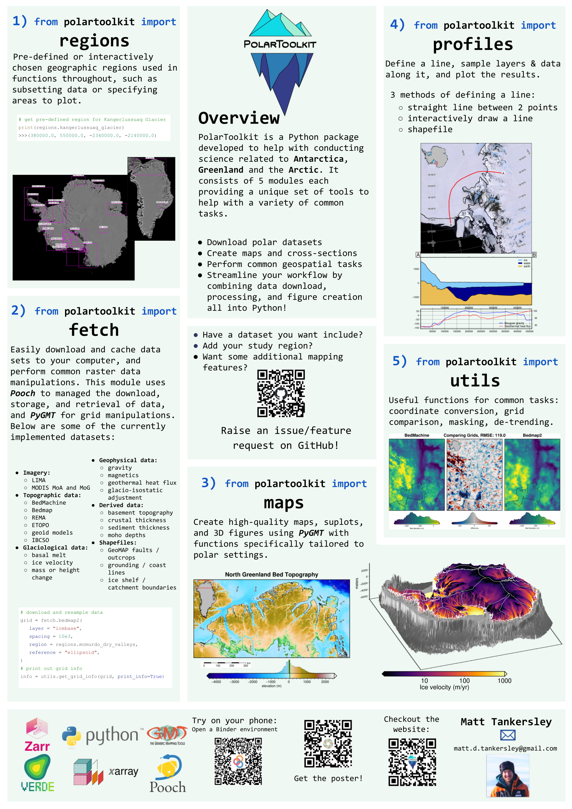
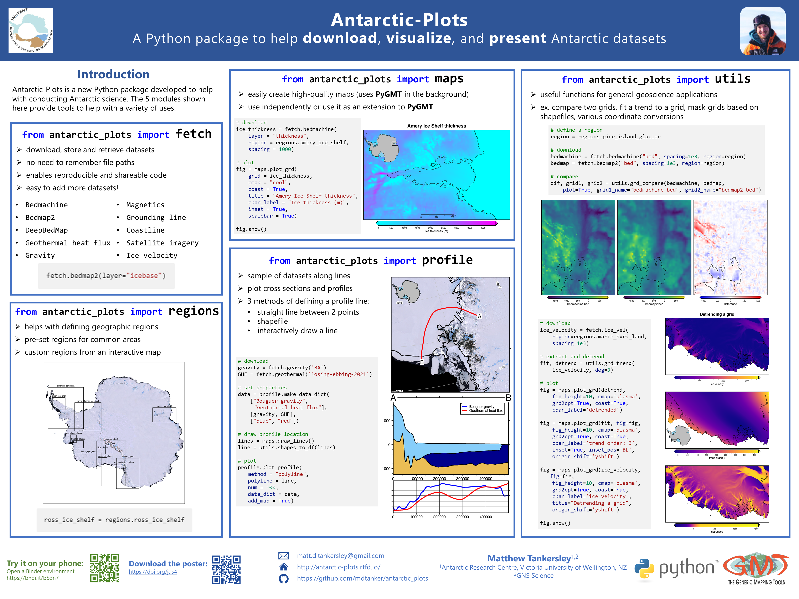

# PolarToolkit: A Python package to help download, visualize, and present polar datasets

Matt Tankersley

[](https://mybinder.org/v2/gh/mdtanker/polartoolkit-posters/HEAD?labpath=Poster_plots.ipynb)

This repo contains some of the materials used during various presentations of the PolarToolkit (previously Antarctic-Plots) package at conferences.

The main notebook, which can be run online with the above Binder link, is [Poster_plots.ipynb](Poster_plots.ipynb).

See the [PolarToolkit website here](https://polartoolkit.readthedocs.io/en/latest/).
See the [PolarToolkit GitHub and source code here](https://github.com/mdtanker/polartoolkit).

If you want to run the notebook locally, you can install the same environment used in the Binder with ```make install```.

# Posters

## version 3

Poster presented at:
* SCAR Open Science Conference
    * Pucon, Chile

[Figshare link for the poster](https://doi.org/10.6084/m9.figshare.21183931.v6)

## version 2

Poster presented at:
* AGU 2023
    * San Fransico, CA, USA

[Figshare link for the poster](https://doi.org/10.6084/m9.figshare.21183931.v4)

## version 1

Poster presented at:
* SCAR INSTANT 2022 workshop: The Future of Geodetic-Geophysical Observational Networks in Antarctica.
    * Fort Collins, CO, USA
* West Antarctic Ice Sheet workshop 2022.
    * Estes Park, CO, USA
* NZ-Australia Antarctic Science Conference, 2022.
    * Christchurch, NZ
    * awarded 2nd best poster
* SCAR INSTANT 2023 conference.
    * Trieste, Italy
    * awarded best poster

[Figshare link for the poster](https://doi.org/10.6084/m9.figshare.21183931.v3)

